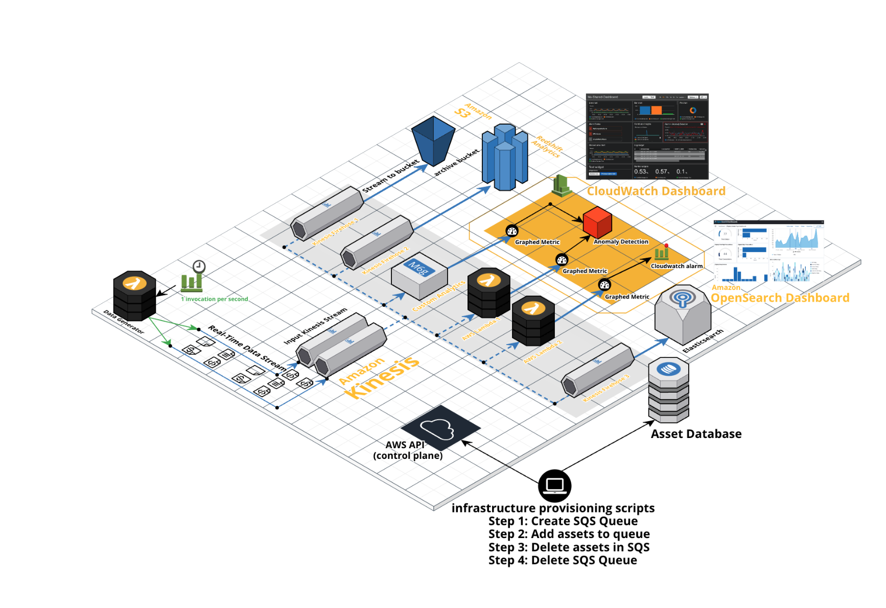

# Game Day 2.0
Game Day 2.0 - The ultimate live dashboard


## Summary

The goal of this project is to populate real-time dashboards with streaming data.
This project uses OpenSearch Dashboards and Amazon CloudWatch Dashboards


## Usage Instructions: 

These steps are guidance and can be executed out of order by an experienced operator:

* Install the resouces for Game Day 2.0 into your AWS Account using the Deployment script
* Create CloudWatch Event to trigger the Gameday 2.0 Data Generator App (the AWS Lambda function provided) 
* Edit the frequency of the Amazon CloudWatch event (defaulted to 1 per day)
* (Optional) Send data manually to the Amazon Kinesis stream using the Gameday 2.0 Data Generator App (the AWS Lambda function provided) 
* Populate the CloudWatch Dashboard using the Game Day 2.0 data stored in Amazon CloudWatch
* Create and Populate the Open Dashboard using the Game Day 2.0 data stored in the Amazon OpenSearch domain
* (Optional) View the provisioned assets for the deployment by tag using Resource Groups in your AWS Console
* Delete the resouces for Game Day 2.0 into your AWS Account using the Undeploy Script


</br>

## Cloudcraft Architecture Diagrams


[Live Cloudcraft Diagram](https://app.cloudcraft.co/view/ac0dc498-4432-434d-902d-c94c69ef7cb9?key=3m40jn0enpfd2t90)


</br>


###  Run Deployment (the AWS Installer) script: 
###### (to be run using the AWS CloudShell or AWS Cloud9):

run this first to create the Deployment Asset Queue

```
aws sqs create-queue --queue-name <any_queue_name_you_choose> --tags tagger=adrianformation,customtagkey=customtagvalue

```
......then run 

```
git clone https://github.com/drumadrian/gameday2.0.git
cd gameday2.0
export ASSET_QUEUE_URL=https://<your SQS queue URL from the create-queue CLI reponse>
bash deploy_gameday20.bash
cd ..
```


</br>

### Run Un-deployment (the AWS Installer) script: 
###### (to be run using the AWS CloudShell or AWS Cloud9):
```
git clone https://github.com/drumadrian/gameday2.0.git
cd gameday2.0
export ASSET_QUEUE_URL=https://<your SQS queue URL from the create-queue CLI reponse>
undeploy_gameday20.bash
cd ..
```

</br>

### How to Manually send Data using AWS Lambda: 
###### (Use the provided AWS Lambda function to send a metric ):

1) Copy the provided AWS Lambda function Input Data


```
TBS 
AWS Lambda input data TBS 
TBS 

```
2) Invoke the `data_generator` AWS Lambda function using the data you copied

3) Look for your data on the Dashboards


</br>

## Cloudcraft Deployment Diagrams



[Live Cloudcraft Diagram](https://app.cloudcraft.co/view/f92edcee-3b1b-451b-b4a8-5a6d8d713056?key=8b3a1802-d067-4198-b1da-141383fce98f)


</br>


## Tutorial Video on YouTube

View on [YouTube](https://youtu.be/PtRwOCQ1zf8):   TBS


</br>

### References:

https://docs.aws.amazon.com/kinesisanalytics/latest/dev/lambda-preprocessing.html

https://aws.amazon.com/cloudshell/

https://docs.aws.amazon.com/ARG/latest/APIReference/Welcome.html

https://docs.aws.amazon.com/ARG/index.html

https://stackoverflow.com/questions/61820968/adding-tags-to-multiple-sqs-queues-through-a-single-cli-command-or-a-script

https://stackoverflow.com/a/73075388/2407387

https://stackoverflow.com/questions/1349404/generate-random-string-characters-in-javascript

https://nodejs.dev/learn/how-to-exit-from-a-nodejs-program

https://www.digitalocean.com/community/tutorials/understanding-variables-scope-hoisting-in-javascript

https://web.dev/promises/

https://docs.aws.amazon.com/AWSJavaScriptSDK/latest/AWS/Firehose.html#createDeliveryStream-property


https://www.freecodecamp.org/news/javascript-console-log-example-how-to-print-to-the-console-in-js/
https://web.dev/promises/

https://www.w3schools.com/jsref/met_win_settimeout.asp

https://developer.mozilla.org/en-US/docs/Web/API/console/table

https://docs.aws.amazon.com/cli/latest/userguide/cli-usage-skeleton.html

https://docs.aws.amazon.com/cli/latest/reference/dynamodb/create-table.html

https://developer.mozilla.org/en-US/docs/Web/JavaScript/Reference/Global_Objects/Promise/all

https://docs.aws.amazon.com/cli/latest/reference/firehose/put-record.html

https://web.dev/promises/

https://developer.mozilla.org/en-US/docs/Web/JavaScript/Reference/Global_Objects/Array/map

https://docs.aws.amazon.com/code-samples/latest/catalog/javascriptv3-cloudwatch-src-putMetricData.js.html


## CLI Provisioning Commands

Create the Adrianformation Asset database:

```

aws dynamodb create-table --cli-input-json file://create_table_input.json

  
```


